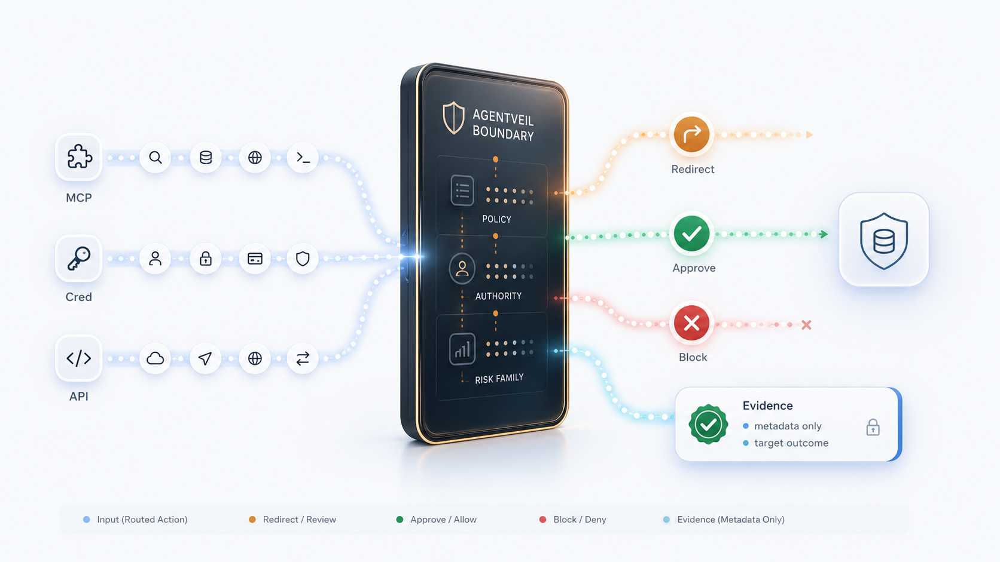

<div align="center">


# AgentVeil

[](https://pypi.org/project/agentveil-mcp-proxy/0.7.25/)
[](https://pypi.org/project/agentveil-mcp-proxy/)
[](https://github.com/agentveil-protocol/agentveil-sdk/actions)
[](LICENSING.md)
[](LICENSING.md)
[](https://glama.ai/mcp/servers/agentveil-protocol/avp-sdk)

**The risk isn't what AI says. It's what AI does.**

AgentVeil is an independent action-control layer for AI agents and MCP tools.
It works alongside agent runtimes such as Cursor, Claude Code, and Codex:
attempt, decision, controlled path when available, local proof.

[Quick Start](#quick-start) · [The Loop](#the-agentveil-loop) · [Connectors](#connectors-available-today) · [Evidence](#bounded-evidence) · [Scope](#scope) · [Design Basis](#design-basis) · [Docs](docs/)

</div>

```bash
pip install agentveil-mcp-proxy
```

**Proxy PyPI**: [agentveil-mcp-proxy](https://pypi.org/project/agentveil-mcp-proxy/) | **Website**: [agentveil.dev](https://agentveil.dev) | **Package source**: [`packages/agentveil-mcp-proxy/`](packages/agentveil-mcp-proxy/)

> **Agent action boundary:** AI runtimes execute agents. AgentVeil mediates
> configured action paths around them. When a native or risky action hits the
> boundary, AgentVeil decides allow, approval required, redirect guidance toward
> a controlled path, or hard-block. Routed MCP calls follow the same decision
> model and record bounded local evidence.
>
> AgentVeil is not machine-wide control. Actions outside configured AgentVeil boundaries are not classified or logged.

<p align="center">
  
</p>

> **Visual overview:** request → AgentVeil boundary → redirect / approval / hard-block → local proof.
>
> **Data handling:** AgentVeil is designed to keep raw MCP arguments local by default and to record bounded metadata and hashes for evidence. See [Data Handling](docs/DATA_HANDLING.md).

## The AgentVeil Loop

AgentVeil is one product loop, not a pile of separate components:

| Step | What happens |
|---|---|
| Attempt | Agent tries a native mutation or routed MCP action in a configured project |
| Decision | AgentVeil returns allow, approval required, redirect, or hard-block |
| Controlled path | When one is available, redirect guidance tells the agent to retry through the managed MCP route |
| Proof | Bounded local evidence records the decision; inspect it with `events show --last` |

Approval fixes actions that need human review. Redirect tells the agent to
retry through the controlled MCP route when one is available. Hard-block means
approval will not help for that action. Local proof is available now through
the CLI—not a future dashboard page.

## What AgentVeil Adds

AgentVeil is not an AI agent and does not replace an agent runtime. It adds a
control layer around actions that are configured to pass through AgentVeil.

| Layer | Agent runtime / framework | AgentVeil adds |
|---|---|---|
| Execution | Runs the agent and exposes tools | Mediates configured action paths before execution |
| Approval | May prompt per tool call, depending on runtime | Adds policy-aware approval for routed writes and mutations |
| Risk classification | Runtime-specific, if present | Shared read / write / destructive / unknown classification |
| Sandbox boundary | Runtime-specific | Project or downstream sandbox limits for routed actions |
| Evidence | Usually chat or runtime logs | Bounded local records with request ids, decisions, and hashes |
| Cross-runtime consistency | Per runtime | Same core control semantics where actions are routed through AgentVeil |

## Quick Start

Use AgentVeil with a supported project connector, or run the Core MCP Proxy directly.

### Cursor project connector

```bash
pip install agentveil-mcp-proxy
agentveil-mcp-proxy setup cursor --choose-folder
```

Choose the project folder you want to protect, then reopen / reload Cursor for that project.

After setup, in the configured project:

- supported native risky agent actions can be blocked before execution;
- the agent receives redirect guidance toward the AgentVeil MCP route;
- routed MCP writes can require approval;
- AgentVeil records bounded local evidence for decisions and outcomes.

Some Cursor versions may require enabling the managed `agentveil-mcp-proxy` MCP server once in **Tools & MCPs** after reload.

### Claude Code project connector

```bash
pip install agentveil-mcp-proxy
agentveil-mcp-proxy setup claude-code --choose-folder --yes
```

Choose the project folder you want to protect, then reopen / reload Claude Code for that project.

After setup, in the configured project:

- supported native Claude Code mutation tools are checked by a project-local hook;
- risky native mutations are blocked with redirect guidance toward the controlled MCP route;
- AgentVeil MCP writes go through the proxy approval path;
- bounded evidence is written locally.

### Codex project connector

```bash
pip install agentveil-mcp-proxy
agentveil-mcp-proxy setup codex --choose-folder --yes
```

Choose the project folder you want to protect, then open / restart Codex for
that project. Codex asks you to trust the AgentVeil project hook once; until
the hook fires and evidence is observed, `setup status --client codex` remains
advisory, not protected.

After setup and hook trust, in the configured project:

- supported native Codex mutation tools are checked by a project-local hook;
- risky native mutations are blocked with redirect guidance toward the controlled MCP route;
- AgentVeil MCP writes go through the proxy approval path;
- bounded evidence is written locally.

### Core MCP Proxy path

For lower-level MCP routing without an IDE connector:

```bash
pip install agentveil-mcp-proxy
agentveil-mcp-proxy init --quickstart-filesystem ./sandbox
agentveil-mcp-proxy doctor --full
agentveil-mcp-proxy run
```

This starts the core route: MCP tool calls explicitly pointed at `agentveil-mcp-proxy`.

### Verify your setup works

After installing a project connector, walk the current shipped path in that
project:

1. Ask the agent to read project context. Routed reads such as `list_workspace`,
   `read_file`, `get_file_info`, and `instruction_surface_status` should allow.
2. Ask the agent to create or edit a file, for example:

```text
Create avp-test.txt with the text hello
```

The configured connector should stop the native mutation with redirect
guidance; the agent should then use the controlled MCP route, where risky
writes require approval.
3. Open the approval page when prompted and review the bounded proof details.
4. Inspect local proof from the CLI:

```bash
agentveil-mcp-proxy events show --last
```

The default human output should include lines like
`decision=approval_required` and `tool=write_file` without dumping raw JSON.
Use `--json` when you need structured fields.

## Connectors Available Today

AgentVeil is built around action-control boundaries. Cursor, Claude Code, and
Codex are the first supported project connectors. The Core MCP Proxy is
runtime-agnostic for MCP clients that are explicitly configured to call it.

| Surface | Mechanism | What it adds | Status |
|---|---|---|---|
| Cursor project connector | Project-local hooks + MCP route | Native mutation block + redirect guidance, routed MCP approval/evidence | Available |
| Claude Code project connector | Project-local `PreToolUse` hook + MCP route | Native mutation block + redirect guidance, routed MCP approval/evidence | Available |
| Codex project connector | Project-local `PreToolUse` hook + MCP route | Native mutation block after one-time hook trust, redirect guidance, routed MCP approval/evidence | Available |
| Core MCP Proxy | MCP transport boundary | Routed MCP policy, approval, redirect / policy-stop outcomes, bounded evidence | Available |

The Python SDK also includes framework examples and optional helper modules for
CrewAI, LangGraph, AutoGen, PydanticAI, OpenAI, Gemini, and AWS Bedrock. Those
examples are not the same as a project connector: they show how agent workflows
can use AgentVeil primitives, while connector coverage still depends on what is
configured and routed through AgentVeil.

Future connectors can follow the same model: configure a boundary, route risky
actions through controlled tools, and record evidence.

## Compatibility

Current connector checks have been run with:

| Surface | Checked version |
|---|---|
| Cursor | 3.6.31 |
| Claude Code | 2.1.126 |
| Codex | interactive TUI hook trust path |
| Python package metadata | Python 3.10-3.13 |

Other versions may work, but are not listed here until verified.

## What AgentVeil Controls

AgentVeil has two public action-control surfaces:

1. **Project connectors**
   - configured per project/workspace;
   - install managed local hooks and MCP route config;
   - block supported native risky agent mutation tools;
   - return redirect guidance toward AgentVeil MCP tools;
   - use MCP Proxy approval and evidence for routed tool calls.

2. **Core MCP Proxy**
   - wraps downstream MCP servers;
   - classifies routed MCP tool calls;
   - returns allow / approval_required / redirect / policy-stop outcomes;
   - records bounded local evidence.

## What AgentVeil Does Not Control

AgentVeil does **not** claim machine-wide control.

It does not control:

- your whole machine;
- every Cursor / Claude / Codex chat globally;
- every autonomous agent runtime globally;
- direct human terminal commands outside configured AgentVeil paths;
- IDE actions outside supported agent tool surfaces;
- MCP servers not routed through AgentVeil;
- disabled, removed, or bypassed hooks;
- unsupported client modes that skip hooks.

Actions outside configured AgentVeil boundaries are not classified or logged.

## Bounded Evidence

AgentVeil records bounded local evidence for controlled actions, so you can
review what an agent requested, whether it was allowed, given redirect guidance,
sent for approval, returned a hard-block decision, and whether the controlled
path completed.

Inspect recent decisions:

```bash
agentveil-mcp-proxy events show --last
agentveil-mcp-proxy events show --last --json
```

Example evidence shape:

```json
{
  "tool": "write_file",
  "decision": "approval_required",
  "approval": "approved",
  "target_reached": true,
  "payload_hash": "sha256:...",
  "timestamp": "2026-06-25T..."
}
```

Evidence is designed for audit and incident review:

- what the agent requested;
- what policy decided;
- whether approval was required;
- whether the action executed;
- hashes and bounded metadata instead of raw prompts or full payloads by default.

This is useful for AI-agent governance, compliance review, and debugging unsafe automation.

## Handling False Positives

AgentVeil is designed to fail closed for risky actions. If a supported agent action is blocked unexpectedly, inspect local decision evidence before changing the setup.

Start with:

```bash
agentveil-mcp-proxy events show --last
agentveil-mcp-proxy setup status --json
```

For routed MCP actions, approval and policy behavior are documented in:

- [Approval Routing](docs/APPROVAL_ROUTING.md)
- [MCP Proxy Operations](docs/MCP_PROXY_OPERATIONS.md)

If a connector is not right for a project, remove only the managed AgentVeil entries for that project instead of editing Cursor / Claude config by hand.

Preview managed removal:

```bash
agentveil-mcp-proxy setup remove cursor
agentveil-mcp-proxy setup remove claude-code
```

Apply removal after review:

```bash
agentveil-mcp-proxy setup remove cursor --yes
agentveil-mcp-proxy setup remove claude-code --yes
```

## Scope

Available today:

- MCP Proxy for routed MCP tool calls;
- project-local Cursor connector;
- project-local Claude Code connector;
- approval / redirect / block / evidence outcomes for routed actions;
- bounded local evidence export.

Available as SDK / protocol primitives:

- capability-token primitives;
- local identity helpers;
- delegation receipts;
- proof packet helpers.

Preview / design-partner product flows:

- session-token flows for reducing repeated approvals;
- richer policy packs;
- credential custody;
- egress boundary;
- hosted approval and team governance.

Not included in the public connector:

- machine-wide shell interception;
- global Cursor / Claude / Codex lock;
- automatic control of unrelated chats;
- private enterprise policy packs;
- hosted auth, licensing, telemetry, or enterprise custody logic.

## Example Risk Patterns

AgentVeil is useful when an agent crosses from reading context into changing state.

| Workflow | Low-risk actions | Higher-risk actions AgentVeil can gate |
|---|---|---|
| Code / PR workflow | read files, inspect git history, list workspace | edit files, run mutation commands, change repo state |
| Content workflow | read drafts, inspect metadata | publish, send, update CMS-like content |
| Data workflow | read query results, inspect schemas | mutate records, export sensitive data, run destructive operations |
| Package / build workflow | inspect dependencies, read lockfiles | install packages, run scripts, change build output |

### Agentic media / broadcast workflows

Agentic media and broadcast workflows often start with read access to files, assets, CMS entries, Git history, or SQL query results, then cross into higher-risk writes and sends: publishing updates, changing a repository, mutating a database, or sending final content.

This is one example of the broader risk pattern:

```text
agent reads metadata        -> allow / observe
agent edits file or record  -> approval required
agent publishes or sends    -> approval / redirect
agent tries unsafe mutation -> block
agent action completes      -> bounded evidence
```

AgentVeil does not ship native broadcast, CMS, or SQL integrations in this package. The example describes the risk pattern for agentic workflows.

## Why This Exists

AI agents increasingly hold direct access to files, repositories, package managers, credentials, and workflow tools.

The risk is no longer only what an AI says. The risk is what an AI can do.

AgentVeil focuses on action control:

1. **Block unsafe native agent actions** in configured project connectors.
2. **Return redirect guidance** so the agent can retry through controlled MCP tools.
3. **Require approval** for routed writes and mutations.
4. **Record bounded evidence** for audit, review, and compliance.

AgentVeil does not solve the general access-control safety problem. It narrows the problem to configured projects, routed MCP calls, supported agent tool paths, and explicit policy decisions.

## Design Basis

The MCP Proxy design is summarized in
[MCP Proxy Design Principles](docs/MCP_PROXY_DESIGN_PRINCIPLES.md).

- Fail-safe defaults: missing policy, missing approval, or unavailable trusted decisions move toward denial or explicit review.
- Complete mediation on routed calls: each protected downstream MCP call goes through the same classify, decide, evidence, and forward-or-deny path.
- Least privilege: approvals are scoped to concrete action context instead of broad standing permission.
- Separation of privilege: local proxy identity, control grants, and backend signing authority are separate roles.
- Bounded evidence: receipts, payload hashes, and local evidence chains bind decisions to the routed action subset.

For deeper security framing, including Saltzer & Schroeder and HRU-aware limits, see [MCP Proxy Design Principles](docs/MCP_PROXY_DESIGN_PRINCIPLES.md).

## Comparison

| Category | Main focus | Where AgentVeil differs |
|---|---|---|
| Prompt/content guardrails | Detect unsafe text | AgentVeil controls actions and tool calls, not only prompts |
| LLM API gateways | Route model traffic | AgentVeil mediates agent tool execution and evidence |
| Direct MCP servers | Expose tools to agents | AgentVeil adds policy, approval, redirect, and evidence between agent and tool when routed through the proxy |
| Secret managers | Store credentials | AgentVeil controls when risky agent actions may execute |
| Generic audit logs | Record app events | AgentVeil binds evidence to specific agent action requests and decisions |

## Reporting Issues And Security Findings

For bugs and integration problems, use the repository issue tracker. For security-sensitive findings, follow the repository [Security Policy](SECURITY.md).

Security-sensitive reports should not include secrets, raw credentials, private keys, or full customer data in public issues.

## Licensing

The root SDK is MIT-licensed.

`agentveil-mcp-proxy` is a separately packaged source-available component under BUSL-1.1. See [Licensing](LICENSING.md) before using it in commercial or competing hosted services.

## Python SDK and advanced protocol primitives

Advanced Python SDK package: `agentveil`.

The public SDK also includes protocol primitives that can support custom integrations: local `did:key` identity, delegation receipts, credential helpers, reputation credential access, receipt helpers, and optional framework adapter modules under `agentveil.tools.*` when their framework dependencies are installed.

These primitives are not the main product path in this README. For direct use, start with:

- [Agent Network (Advanced)](docs/ADVANCED_AGENT_NETWORK.md)
- [DelegationReceipt Guide](docs/DELEGATION_RECEIPT.md)
- [Proof Packet Guide](docs/PROOF_PACKET.md)
